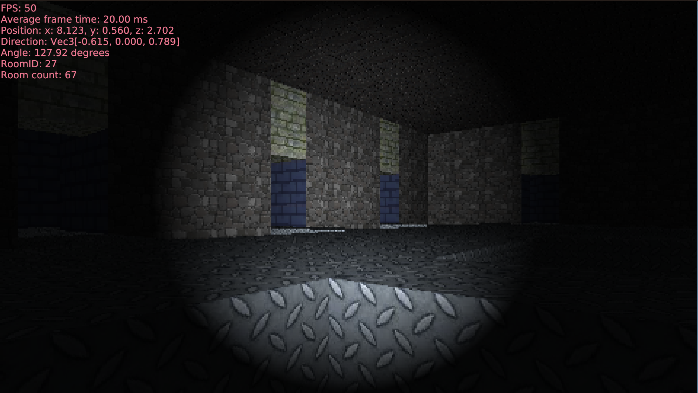

# RayVenture

`RayVenture` is a game. Check out [`pixels`](https://github.com/parasyte/pixels) which helped me learn more about this type of rendering.

Excellent explanations about the raycaster [here](https://lodev.org/cgtutor/raycasting.html#The_Basic_Idea_) and [here](https://permadi.com/1996/05/ray-casting-tutorial-table-of-contents/).

> NOTE to me: all walls and platforms are being drawn from bottom to top! 

## Roadmap

- [x] Implement a working 2D raycaster with a specific FOV 
- [x] Draw walls out of distance values
- [x] Add textures to walls
- [x] Add special textures with half transparency or full transparency
- [x] Add textures to floor and ceiling
- [x] Add voxel objects
- [x] Add colors to voxel objects
- [x] Render objects from closest to furthest while skipping drawing over already drawn full opacity pixels in order to increase performance
- [x] Implement drawing directly in the ray casting function to avoid memory allocations and preserve performance
- [x] Add different floor and ceiling textures for different map tiles
- [x] Add an ability to look freely up and down, moving up and down
- [x] Improve how map tiles are stored, split the map into three maps, one for regular wall tiles, one for ceiling tiles and one for floor tiles
- [x] Rotate the canvas by 90 degrees so drawing is more efficient
- [x] Simplify map creation by making possible creating maps in external .txt files while following a defined format
- [x] Add portals
- [x] Add shading/lightning effects
- [x] Draw a skybox
- [x] Add different height walls while also their tops sides (floor), if seen from above, and bottom sides (ceilings), if seen from below
- [x] Reimplement voxel objects again :/
- [ ] Add removable object walls (cool opening or moving animation with voxels)
- [ ] Add collision detection (circle-rectangle collision detection)
- [ ] Add a UI
- [ ] Go unsafe for performance increase after most of the project is finished

## Reincarnation

- [ ] Implement a new system for generating a map of rooms instead of the old one with only *rng*.

### Some old comments

- For the record, I have tried adding FXAA in the fragment shader, which ended up in a weird output, have tried MSAA, but it doesn't work on textures, have tried applying bilinear texture filtering but unnoticeable.